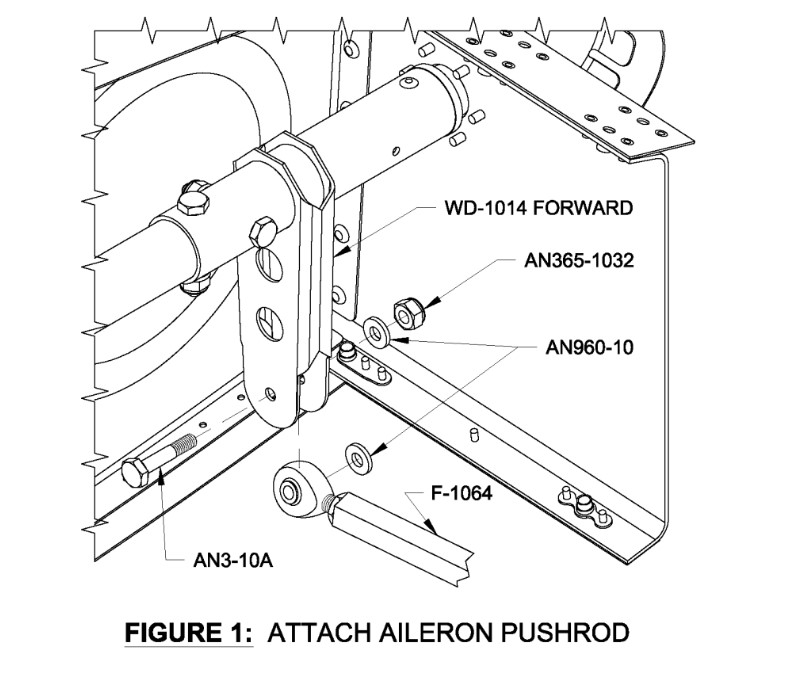

### 1. Elevator Control Rod Inspection
    * A. Remove the tunnel covers, ref [AMM Task 25-70-01-01](/AMM/Equipment/Panels/Maintenance Practices/tunnelcover.mdx).
    * B. Remove the elevator horn inspection panels. 
    * C. Inspect the rods for cracks, gouges or scratches. 
    * D. Inspect the connecting hardware.
        * (1) Ensure the front rod end has safety wire and the safety wire is retained within the fastener stackup. 
        * (2) Check the jam nuts for condition and security.
        * (3) Check the torque stripe for continuity. If broken, re-tighten jam nuts and re-apply torque stripe. Ensure more rod end engagement is over half.
        * (4) Check the torque on the AN365-428 nut on the WD-1010 assembly. 
        * (5) Check the torque on the AN365-1032 nuts on the Elevator Idler Arm. 
        * (6) Check the torque on the AN365-1032 nuts on the Elevator Bellcrank Assy. 
        * (7) Inspect the attaching hardware on the elevator horn for proper torque and security. 

### 2. Stick Base Inspections
    * A. Remove the front seats, ref [AMM Task 25-10-01-01](AMM/Equipment/Front Seats/Maintenance Practices/seatremoval.mdx).
    * B. Remove the access panel in between the seat rails. 
    * C. Inspect the attaching fasteners for security.   

### 3. Aileron Control Rod Inspections
    * A. Remove the wing root fairings as required. 
    * B. Inspect the aileron pushrod attachment for security. 
    * C. Inspect the Wing aileron control rod attachment for security. 

### 4. Aileron Bellcrank Inspection
    * A. Remove the outboard wing access panel. 
    * B. Inspect the aileron bellcrank pushrod attachments for security.  
    * C. On the right wing, inspect the autopilot servo connection and attachment fittings. 

### 5. Rudder Cable Inspection
    * A. Remove the forward tunnel covers if required, ref [AMM Task 25-70-01-01](AMM/Equipment/Panels/Maintenance Practices/tunnelcover.mdx)
    * B. Ensure the castle nut is correctly torqued and the MS24655-132 cotter pin is present on the rudder control arms. 
